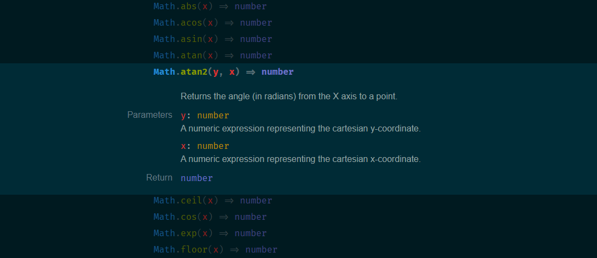

# [Trowser](https://trowser.onrender.com/)

NPM Package dynamic method browser

Trowser automatically searched for typescript declaration files for a npm package and displays a searcheable list of methods. Utilize Fuzzy searching to quickly search for methods by name, parameter name, parameter type, return type,etc.

## Search Filters

| prefix | searches in    |
| ------ | -------------- |
| p=     | parameter name |
| a=     | parents        |
| r=     | return type    |
| n=     | name           |
| t=     | parameter type |

Example:

- `p=pred` will search for methods with a parameter that matches **pred**
- `r=boolean` will search for methods with return type that matches **boolean**
- `p=name r=str get` will search for methods with paramater matching **name**, return matching **str** _AND_ anything matching **get**

## Extended search

Trowser utilizes [Fuse.js](https://fusejs.io/) to power it's search functionality. As such, the [Extended Search](https://fusejs.io/examples.html#extended-search) can be used to narrow down the results.

## Roadmap

*Coming soon*

## Contributing

*Coming soon*